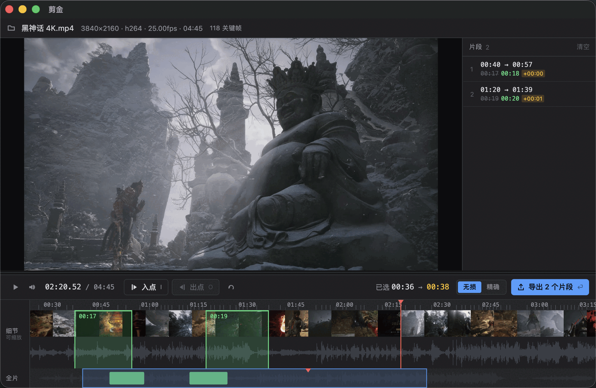

**剪金**不是剪辑器。

剪辑器假设你已经知道要什么，而剪金假设你还不知道——所以整个界面为「比实时更快地扫描」
而设计：键盘打点，`-c copy` 零重编码导出。

<Frame caption="主界面：播放器、片段列表，与「细节 / 全片」双轨时间轴。">

</Frame>

右侧片段列表里划掉的时长是**标记时长**，其后是无损模式吸附起点后的**真实导出时长**，
橙色徽标是两者之差——[偏差始终摆在明面上](/export#偏差是可见的)。

## 它解决什么

<CardGroup cols={2}>
  <Card title="比实时更快地扫描" icon="fast-forward">
    `L` 一路加速到 16x，`I` / `O` 单手打点。鼠标只用于事后微调。
  </Card>
  <Card title="导出零重编码" icon="scissors">
    默认走 `-c copy`：不解码、不重编码，画质不变，速度只受磁盘限制。
  </Card>
  <Card title="偏差不藏着" icon="badge-alert">
    无损切割必然有吸附偏差。剪金把它算出来标在片段上，而不是让你导完才发现。
  </Card>
  <Card title="大文件也不卡" icon="gauge">
    缩略图与波形可以单独关闭——关掉就是真的不启动对应的 ffmpeg 进程。
  </Card>
</CardGroup>

## 快速上手

<Steps>
  <Step title="打开视频">
    `⌘/Ctrl+O`。切割与分析依赖本机的 ffmpeg / ffprobe，见[安装](/install)。
  </Step>
  <Step title="扫描">
    `Space` 播放，`L` 加速（1→2→4→8→16x），`J` 减速，`K` 回到 1x。
  </Step>
  <Step title="打点">
    看到有用的段落，按 `I` 标入点、`O` 标出点。标重叠了不必管，片段会自动合并。
  </Step>
  <Step title="导出">
    `⌘/Ctrl+E`。默认无损模式，几乎瞬间完成。
  </Step>
</Steps>

## 技术栈

| 层 | 选型 | 说明 |
| --- | --- | --- |
| UI | Flutter，**全部自绘** | 不引入 `material.dart`，入口用 `WidgetsApp` |
| 播放 | `media_kit`（libmpv） | libmpv 即 ffmpeg，ffmpeg 能解的都能播 |
| 切割 / 探测 | ffmpeg / ffprobe 子进程 | 无损 `-c copy` |

**播放与切割是两套独立的管线**：播放走 libmpv，切割与分析走 ffmpeg 子进程。
两者不共享解码器，改一边不影响另一边。

:::note
剪金是自由软件，源码托管在 GitHub：[hungtcs/JianJin](https://github.com/hungtcs/JianJin)。
:::
